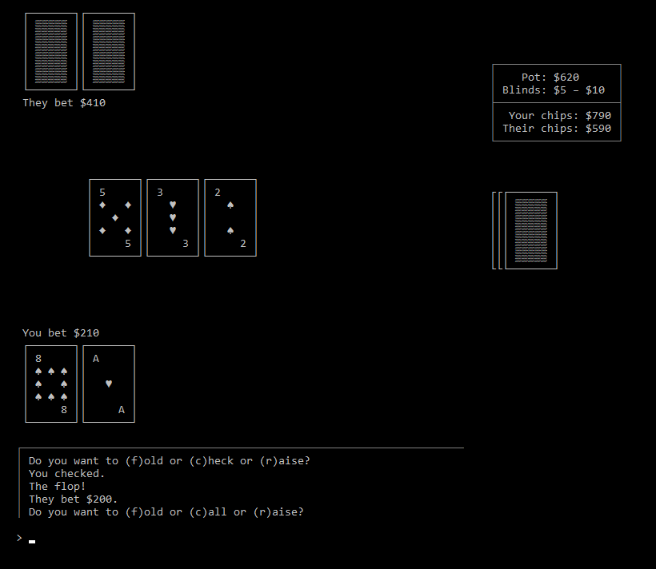

**JPoker** is a simple implementation of Texas Hold 'em (head-to-head no-limit tournament style) to
learn cards and Java.

## Implementation ##
Since I'm not a card player and the goal of this project isn't to gain a deep understanding of the
game, I'll use these approximations of the standard rules. Any deviations are hereby declared house
rules. In particular, the Ace card is always low because that just makes sense. :)

### Game flow ###
On launch:

  1. each player gets $1,000 in chips.
  2. set big blind = $10 (one hundredth of buy-in; this is the minimum bet during play), and small
     blind = $5 (half big blind).
  3. randomly choose who gets dealer button (i.e. who starts).

The Preflop:

  1. dealer pays small blind into pot; other pays big blind.
     _The big blind counts as the initial bet for call/raise._
  2. assign each player two cards ("hole cards"), one at a time, starting with non-dealer.
     _Each player only sees their own cards._
  3. betting round.

The Flop:

  1. Deal three community cards.
  2. betting round. (No initial bet, so first player can check/bet instead of call/raise.)
	
The Turn:

  1. Deal one community card.
  2. betting round. Minimum bet is now double big blind.

The River:

  1. Deal one community card.
  2. betting round (identical to turn).

The Showdown:

  1. each player shows their hand.
  2. Best hand wins the pot based on poker hand ranking. If both players have the same hand
     type, the player with the highest combined card value wins. If they have identical card
     values, they split the pot.

Post-hand:

  1. If player can't pay big blind, they lose.
  2. Else set dealer to whoever went second in the last hand, and go to preflop #1.

### Betting rounds ###
In a betting round:

  1. each player chooses an action:
     * "Fold": pay nothing further to the pot and forfeit hand; other player takes pot, start new
        hand.
     * "Call" (or "Check" if no previous bet): match the last bet (i.e. increase total pot
        contribution to match last player's).
     * "Raise" (or "Bet" if no previous bet): bet any amount between double last bet and total
       remaining chips.
  2. if player can't call/raise due to insufficient funds, they skip all actions until the end of
     the hand.
  3. repeat steps 1–2 until both players have the same amount in the pot.

## Running the game from source ##

1. Compile the project into a `.jar` file.
2. Run the compiled file with `java -jar JPoker.jar`.

### References ###

* Rules
  * _[Texas Hold'em Rules and Game Play](http://www.pokerlistings.com/poker-rules-texas-holdem)_, PokerListings
  * _[Hold'em Betting Rules: No-Limit, Limit, Pot-Limit](http://www.pokerlistings.com/texas-holdem-betting-rules)_, PokerListings
  * _[Texas Hold'em](https://www.pagat.com/poker/variants/texasholdem.html)_, John McLeod 
  * _[Texas hold 'em](https://en.wikipedia.org/wiki/Texas%5Fhold%5F%27em#Rules)_, Wikipedia
  * _[How To Play | Texas Holdem Rules](http://www.wsop.com/poker-games/texas-holdem/rules/)_, WSOP
  * _[Texas Hold'em Poker Heads Up](http://www.izzygames.com/texas-holdem-poker-heads-up-t4278.html)_, IzzYgames
* _[ANSI/VT100 Terminal Control Escape Sequences](http://www.termsys.demon.co.uk/vtansi.htm)_